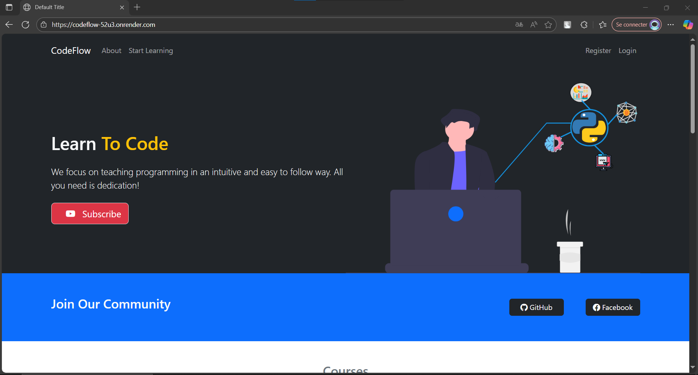
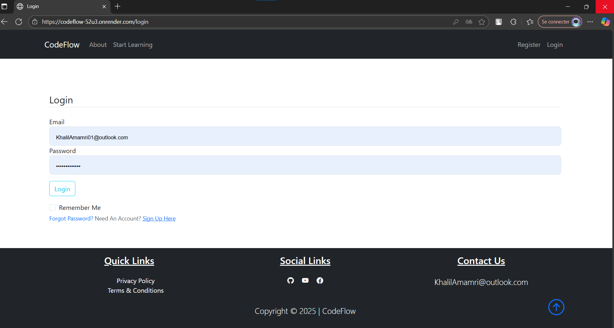
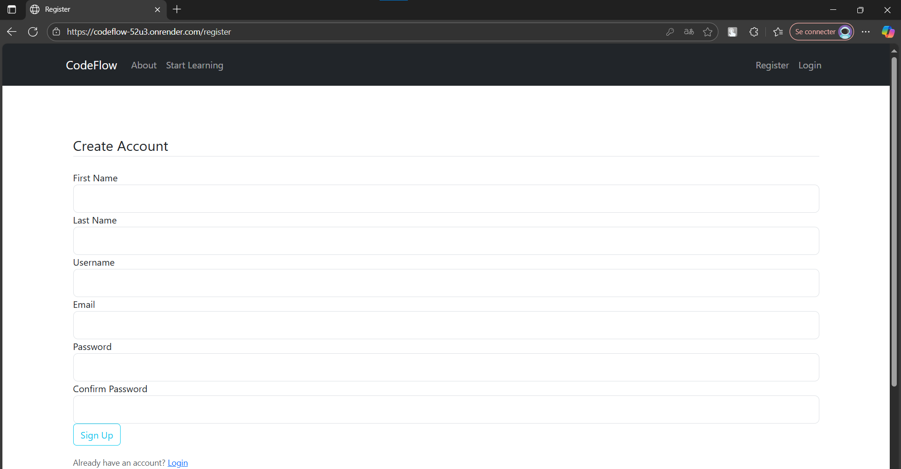
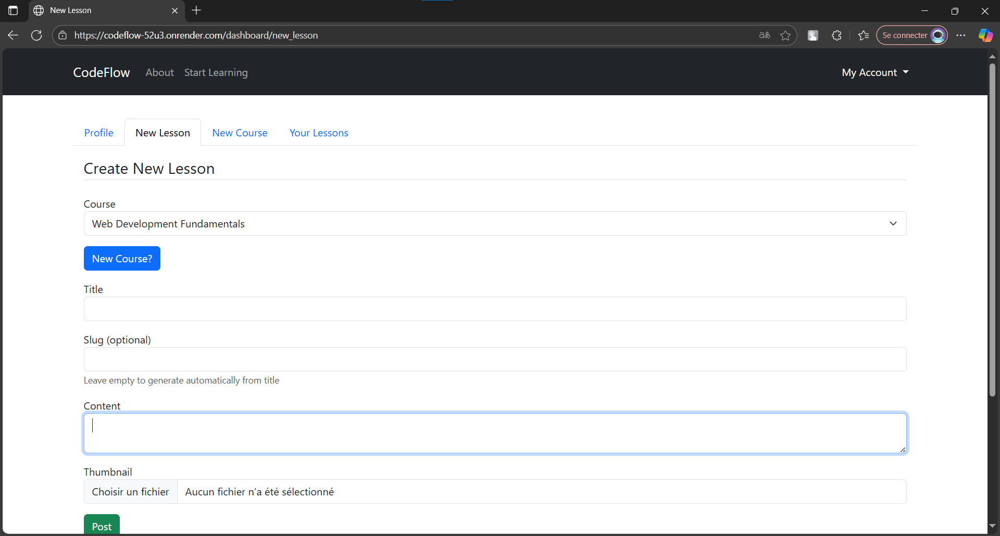
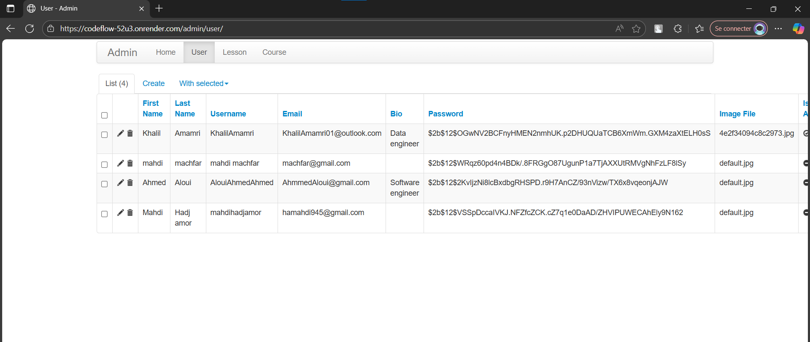

# 🚀 CodeFlow

<div align="center">


**A modern, professional learning platform for programming and technology education**

[](https://python.org)
[](https://flask.palletsprojects.com)
[](https://getbootstrap.com)
[](https://sqlalchemy.org)
[](LICENSE)

[Features](#-features) • [Installation](#-installation) • [Usage](#-usage) • [API](#-api) • [Contributing](#-contributing) • [License](#-license)

</div>

---

<!-- Project overview image -->
<div align="center">



*Screenshot — Home page / course list (click to enlarge on GitHub)*

</div>

<!-- End overview image -->

<!-- Compact gallery of additional screenshots -->
<div align="center">

**Other screenshots:**

[{width=150}](codeflow/static/overview_images/login.png)
&nbsp;
[{width=150}](codeflow/static/overview_images/createaccount.png)
&nbsp;
[{width=150}](codeflow/static/overview_images/create_new_lesson.png)
&nbsp;
[{width=150}](codeflow/static/overview_images/admin_page.png)

*Click any thumbnail to view the full-size image.*

</div>


## 📖 About

**CodeFlow** is a comprehensive learning management system designed to provide a smooth, intuitive experience for both learners and instructors. Built with modern web technologies, it offers structured learning paths, interactive content management, and a professional admin interface.

### 🎯 Mission
To create a seamless learning experience that flows naturally from beginner to advanced, making programming education accessible and engaging for everyone.

---

## ✨ Features

### 👨‍🎓 For Learners
- 📚 **Structured Learning Paths** - Browse curated courses and lessons
- 📊 **Progress Tracking** - Monitor your learning journey with detailed analytics
- 🎨 **Modern UI/UX** - Clean, responsive design that works on any device
- 🔍 **Smart Search** - Find content quickly with advanced filtering
- 💾 **Bookmarks** - Save favorite lessons for later review
- ⭐ **Rating System** - Rate and review courses to help others

### 👨‍🏫 For Instructors
- ✏️ **Rich Content Editor** - Create engaging lessons with TinyMCE
- 🖼️ **Media Management** - Upload images, videos, and course materials
- 📈 **Analytics Dashboard** - Track course performance and student engagement
- 🎯 **Course Management** - Organize content with tags and categories
- 👥 **Student Management** - Monitor progress and provide feedback

### ⚙️ Technical Features
- 🔐 **Secure Authentication** - Role-based access control with Flask-Login
- 📧 **Email Integration** - Automated notifications and password reset
- 🗄️ **Database Migrations** - Version-controlled schema management
- 🌍 **Environment Configuration** - Secure .env-based configuration
- 📱 **Responsive Design** - Mobile-first approach with Bootstrap 5
- 🚀 **Admin Panel** - Comprehensive Flask-Admin interface

---

## 🛠️ Technology Stack

<div align="center">

| Category | Technology | Version | Purpose |
|----------|------------|---------|---------|
| **Backend** |  | 3.8+ | Core language |
| **Framework** |  | 2.0+ | Web framework |
| **Database** |  | Latest | ORM & migrations |
| **Frontend** |  | 5.3+ | CSS framework |
| **Admin** |  | Latest | Admin interface |
| **Email** |  | Latest | Email service |

</div>

---

## 🚀 Quick Start

### Prerequisites

-  Python 3.8 or higher
-  Git for version control
-  pip for package management

### Installation

1. **📥 Clone the repository**
   ```bash
   git clone https://github.com/yourusername/codeflow.git
   cd codeflow
   ```

2. **🐍 Create virtual environment**
   ```bash
   python -m venv venv
   ```

3. **🔧 Activate virtual environment**
   
   **Windows:**
   ```powershell
   venv\Scripts\Activate.ps1
   ```
   
   **macOS/Linux:**
   ```bash
   source venv/bin/activate
   ```

4. **📦 Install dependencies**
   ```bash
   pip install -r requirements.txt
   ```

5. **⚙️ Environment setup**
   
   Create a `.env` file in the project root:
   ```env
   SECRET_KEY=your-super-secret-key-here
   SQLALCHEMY_DATABASE_URI=sqlite:///codeflow.db
   MAIL_SERVER=smtp.gmail.com
   MAIL_PORT=587
   MAIL_USE_TLS=true
   EMAIL_USER=your-email@example.com
   EMAIL_PASS=your-app-password
   MAIL_DEFAULT_SENDER=your-email@example.com
   ```

6. **🗄️ Database setup**
   ```bash
   # Set Flask app
   export FLASK_APP=run.py  # macOS/Linux
   # $env:FLASK_APP = "run.py"  # Windows PowerShell
   
   # Initialize database
   flask db init
   flask db migrate -m "Initial migration"
   flask db upgrade
   ```

7. **👤 Create admin user**
   ```bash
   flask shell
   ```
   ```python
   from codeflow import db, bcrypt
   from codeflow.models import User
   
   admin = User(
       first_name='Admin',
       last_name='User',
       username='admin',
       email='admin@codeflow.com',
       password=bcrypt.generate_password_hash('admin123').decode('utf-8'),
       is_admin=True
   )
   
   db.session.add(admin)
   db.session.commit()
   exit()
   ```

8. **🚀 Run the application**
   ```bash
   python run.py
   ```

9. **🌐 Access the application**
   
   Open your browser and navigate to: `http://127.0.0.1:5000`

---

## 📁 Project Structure

```
CodeFlow/
├── 📁 codeflow/                 # Main application package
│   ├── 📄 __init__.py          # Application factory
│   ├── 📄 config.py            # Configuration settings
│   ├── 📄 models.py            # Database models
│   ├── 📁 admin_bp/            # Admin blueprint
│   ├── 📁 courses/             # Courses blueprint
│   ├── 📁 lessons/             # Lessons blueprint
│   ├── 📁 users/               # Users blueprint
│   ├── 📁 main/                # Main routes blueprint
│   ├── 📁 errors/              # Error handlers
│   ├── 📁 templates/           # Jinja2 templates
│   └── 📁 static/              # Static files (CSS, JS, images)
├── 📁 migrations/              # Database migrations
├── 📁 instance/                # Instance-specific files
├── 📄 .env                     # Environment variables
├── 📄 run.py                   # Application entry point
└── 📄 README.md               # This file
```

---

## 🔧 Configuration

### Environment Variables

| Variable | Description | Default | Required |
|----------|-------------|---------|----------|
| `SECRET_KEY` | Flask secret key for sessions | `dev-change-me` | ✅ |
| `SQLALCHEMY_DATABASE_URI` | Database connection string | `sqlite:///codeflow.db` | ✅ |
| `EMAIL_USER` | Email username for notifications | - | ❌ |
| `EMAIL_PASS` | Email password or app password | - | ❌ |
| `MAIL_SERVER` | SMTP server | `smtp.gmail.com` | ❌ |
| `MAIL_PORT` | SMTP port | `587` | ❌ |
| `MAIL_USE_TLS` | Use TLS encryption | `true` | ❌ |

### Database Configuration

- **Development**: SQLite (default)
- **Production**: PostgreSQL, MySQL, or other SQLAlchemy-supported databases

---

## 👥 User Roles

### 👤 Regular Users
- Create and manage their own lessons
- Access dashboard and profile management
- Browse courses and lessons
- Rate and review content

### 👑 Admin Users
- Full access to Flask-Admin panel
- Manage all users, courses, and lessons
- System administration capabilities
- Analytics and reporting

---

## 🚀 Deployment

### Production Checklist

- [ ] Set `FLASK_ENV=production`
- [ ] Use a production WSGI server (Gunicorn, uWSGI)
- [ ] Configure a production database (PostgreSQL recommended)
- [ ] Set up proper email configuration
- [ ] Configure static file serving
- [ ] Set up SSL/HTTPS
- [ ] Configure proper logging

### Example Production Setup

```bash
# Install production dependencies
pip install gunicorn psycopg2-binary

# Run with Gunicorn
gunicorn -w 4 -b 0.0.0.0:8000 run:app
```

---

## 📊 API Documentation

### Authentication Endpoints

| Method | Endpoint | Description | Auth Required |
|--------|----------|-------------|---------------|
| `POST` | `/register` | User registration | ❌ |
| `POST` | `/login` | User login | ❌ |
| `GET` | `/logout` | User logout | ✅ |
| `POST` | `/reset_password` | Request password reset | ❌ |

### Content Endpoints

| Method | Endpoint | Description | Auth Required |
|--------|----------|-------------|---------------|
| `GET` | `/courses` | List all courses | ❌ |
| `GET` | `/course/<slug>` | Get course details | ❌ |
| `POST` | `/new_course` | Create new course | ✅ |
| `GET` | `/lesson/<course_slug>/<lesson_slug>` | Get lesson content | ❌ |
| `POST` | `/new_lesson` | Create new lesson | ✅ |

---

## 🤝 Contributing

We welcome contributions! Please follow these steps:

1. **🍴 Fork the repository**
2. **🌿 Create a feature branch**
   ```bash
   git checkout -b feature/amazing-feature
   ```
3. **💾 Commit your changes**
   ```bash
   git commit -m 'Add amazing feature'
   ```
4. **📤 Push to the branch**
   ```bash
   git push origin feature/amazing-feature
   ```
5. **🔀 Open a Pull Request**

### Development Guidelines

- Follow PEP 8 style guidelines
- Write comprehensive tests
- Update documentation
- Ensure all tests pass

---

## 📝 License

This project is licensed under the MIT License - see the [LICENSE](LICENSE) file for details.

---

## 📞 Contact & Support

<div align="center">

**CodeFlow Development Team**

[](mailto:KhalilAmamri@outlook.com)
[](https://github.com/yourusername)
[](https://youtube.com/@yourchannel)

</div>

---

## 🙏 Acknowledgments

- [Flask](https://flask.palletsprojects.com/) community for the excellent framework
- [Bootstrap](https://getbootstrap.com/) team for the responsive UI components
- [SQLAlchemy](https://sqlalchemy.org/) for the powerful ORM
- All contributors and users of this platform

---

<div align="center">

**CodeFlow** - Where learning flows naturally 🚀


</div>
